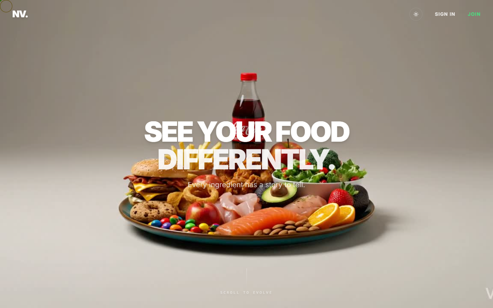
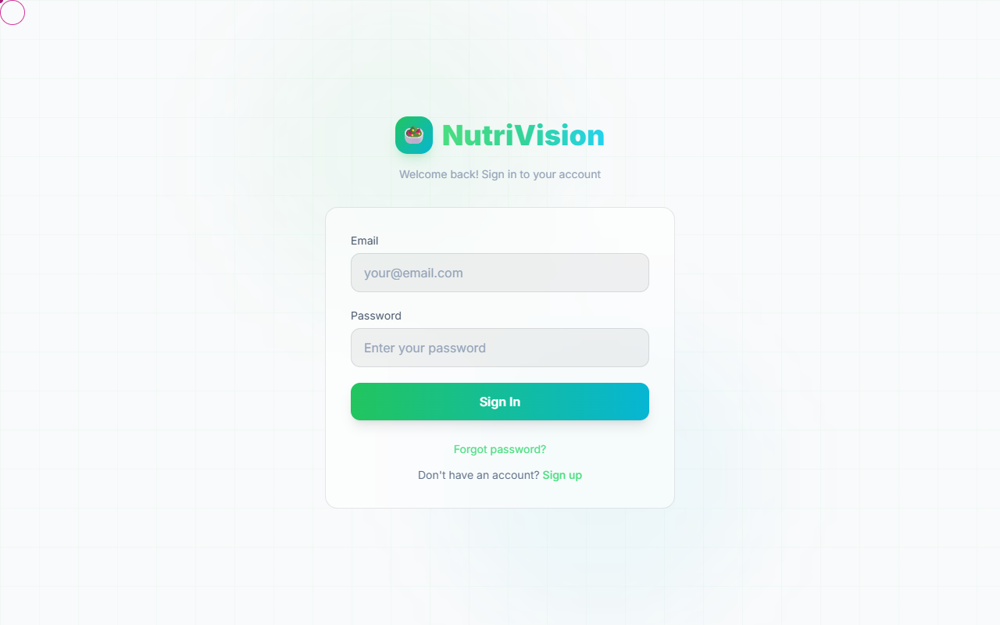
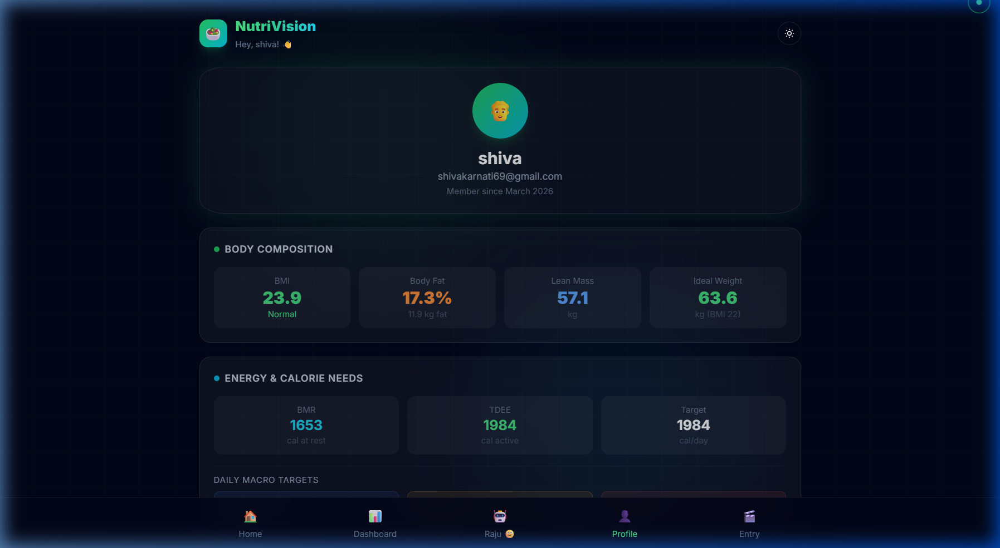
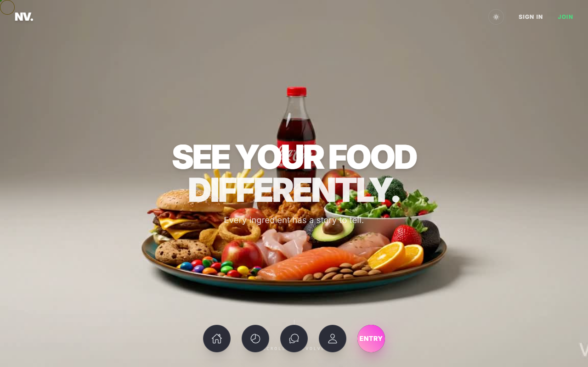

<p align="center">
  
</p>

<h1 align="center">🥗 NutriVision</h1>
<h3 align="center">AI-Powered Nutrition Analysis — Image · Text · Voice</h3>

<p align="center">
  
  
  
  
  
  
  
</p>

<p align="center">
  <b>🌟 LIVE APP: <a href="https://nutrivision-wnts.onrender.com">https://nutrivision-wnts.onrender.com</a> 🌟</b><br/><br/>
  <i>✅ This application is fully deployed and operational.</i><br/>
  <i>💻 <b>For the best experience, please use a PC.</b></i><br/>
  <i>⏳ <b>Note:</b> The backend is deployed on a free Render instance. Please wait up to 50 seconds for the server to wake up and for the 3D graphics to load on your first visit!</i>
</p>

---

## 🎬 Demo

> Full walkthrough — navigating pages, analyzing food, switching themes, and chatting with the AI coach.

<p align="center">
  
</p>

---

## 📸 Screenshots

<table>
  <tr>
    <td align="center" width="50%">
      <b>🏠 Home — Light Mode</b><br/>
      
      <br/><sub>Tri-modal input with quick suggestion chips</sub>
    </td>
    <td align="center" width="50%">
      <b>🌙 Home — Dark Mode</b><br/>
      
      <br/><sub>Glassmorphism theme with glowing accents</sub>
    </td>
  </tr>
  <tr>
    <td align="center">
      <b>📷 Image Upload</b><br/>
      
      <br/><sub>Drag-and-drop or camera capture</sub>
    </td>
    <td align="center">
      <b>🍟 Nutrition Card</b><br/>
      
      <br/><sub>Full macro/micro breakdown with health score</sub>
    </td>
  </tr>
  <tr>
    <td align="center">
      <b>📊 Dashboard</b><br/>
      
      <br/><sub>Calorie budget, macro cards, trend charts</sub>
    </td>
    <td align="center">
      <b>🤖 AI Health Coach</b><br/>
      
      <br/><sub>Personalized advice based on your profile</sub>
    </td>
  </tr>
  <tr>
    <td align="center">
      <b>👤 Profile & Body Metrics</b><br/>
      
      <br/><sub>BMI, body fat, BMR, TDEE, macro targets</sub>
    </td>
    <td align="center">
      <b>🎬 Landing Animation</b><br/>
      
      <br/><sub>GSAP scroll-driven canvas animation</sub>
    </td>
  </tr>
</table>

---

## 🧠 About

NutriVision is a full-stack web application built with **React 19** and **Express 5** that uses **Google Gemini AI** to analyze food nutrition from three input modes:

| Input | How it works |
|:---:|:---|
| 📷 **Image** | Upload or capture a photo — AI identifies the food and returns macros, vitamins, minerals |
| 📝 **Text** | Type "2 chapatis with dal" — instant nutritional breakdown |
| 🎙️ **Voice** | Speak via Web Speech API — hands-free nutrition tracking |

Each analysis returns a detailed card with **calories, protein, carbs, fat, fiber, vitamins, minerals, health score (1–100), allergen warnings, and diet tags**.

---

## ✨ Features

**Core Analysis**
- Tri-modal input (image / text / voice)
- Google Gemini AI with **automatic model cascade** (`2.5-flash → 2.0-flash → 1.5-flash`) and retry logic
- Comprehensive nutrition cards with health score, allergens, and diet tags
- Adjustable serving weight slider

**Authentication & Security**
- Email OTP verification (6-digit, 10-min expiry)
- JWT token auth with 30-day sessions
- Password reset flow with OTP
- bcryptjs hashing (12 rounds)

**Dashboard & Analytics**
- Period-based filtering (today / week / month / all)
- Calorie budget donut chart + macro breakdown
- Calorie trend visualization (Recharts)
- Full meal history with auto-save

**Health Profile**
- Multi-step onboarding flow
- Body composition: BMI, body fat %, lean mass, ideal weight
- Energy needs: BMR (Mifflin-St Jeor), TDEE, daily macro targets

**AI Health Coach**
- Personalized chat based on user profile
- Context-aware conversation history
- Quick suggestion chips (meal plans, exercises, hydration)

**UI/UX**
- Dark/light mode with smooth CSS transitions
- Glassmorphism design with backdrop blur
- Framer Motion page transitions + GSAP scroll animation
- Custom cursor, mobile-first responsive layout
- Bottom navigation bar with gradient indicators

---

## 🏗️ Tech Stack

| Layer | Technology | Purpose |
|:---|:---|:---|
| **Frontend** | React 19 + Vite 7 | Single-page app with HMR |
| **Styling** | Tailwind CSS 3.4 | Utility-first responsive design |
| **Animations / 3D** | Framer Motion + GSAP + Spline | Page transitions, scroll animations, 3D graphics |
| **Charts** | Recharts | Dashboard data visualization |
| **Backend** | Express 5 + Node.js | RESTful API backend |
| **AI** | Google Gemini (multi-model cascade) | Food recognition, nutrition extraction, chat |
| **Database** | PostgreSQL 14+ | Users, analysis history, OTPs |
| **Auth** | JWT + bcryptjs | Stateless token authentication |
| **Email** | Nodemailer + Gmail SMTP | OTP delivery |
| **Upload** | Multer (memory storage) | In-memory image processing |

---

## 📁 Project Structure

```
nutrivision/
│
├── frontend/                         # ── React Frontend (Vite) ──────────
│   ├── public/
│   │   ├── logo.jpg
│   │   └── sequence/               # Landing animation frames (140 frames)
│   ├── src/
│   │   ├── components/
│   │   │   ├── CustomCursor.jsx     # Interactive dot-follower cursor
│   │   │   ├── History.jsx          # Analysis history list
│   │   │   ├── Home3DAnimation.jsx  # 3D animation on home page
│   │   │   ├── ImageUpload.jsx      # Drag-drop + camera input
│   │   │   ├── NutriScrollCanvas.jsx# GSAP scroll animation
│   │   │   ├── NutritionCard.jsx    # Full nutrition result display
│   │   │   ├── SpeechInput.jsx      # Web Speech API voice input
│   │   │   ├── TextInput.jsx        # Text food description input
│   │   │   ├── ThemeToggle.jsx      # Dark/light mode toggle
│   │   │   ├── TubesBackground.jsx  # Animated background
│   │   │   └── ui/                  # Shared UI primitives
│   │   ├── context/
│   │   │   └── AuthContext.jsx      # JWT auth state (React Context)
│   │   ├── pages/
│   │   │   ├── Chatbot.jsx          # AI health coach chat
│   │   │   ├── Dashboard.jsx        # Nutrition analytics
│   │   │   ├── ForgotPassword.jsx   # Password reset flow
│   │   │   ├── Landing.jsx          # Animated landing page
│   │   │   ├── Login.jsx            # Login form
│   │   │   ├── Onboarding.jsx       # Multi-step profile setup
│   │   │   ├── Profile.jsx          # User profile & body metrics
│   │   │   └── Signup.jsx           # OTP-verified registration
│   │   ├── services/
│   │   │   └── api.js               # Axios HTTP frontend
│   │   ├── App.jsx                  # Root component + routing
│   │   ├── index.css                # Global styles + Tailwind
│   │   └── main.jsx                 # React DOM entry point
│   ├── index.html
│   ├── vite.config.js
│   ├── tailwind.config.js
│   └── package.json
│
├── backend/                          # ── Express Backend ────────────────
│   ├── config/
│   │   └── db.js                    # PostgreSQL pool + auto-migration
│   ├── middleware/
│   │   └── auth.js                  # JWT verify + optional auth
│   ├── routes/
│   │   ├── analyzeRoutes.js         # Food analysis endpoints
│   │   ├── authRoutes.js            # Signup, login, OTP, reset
│   │   ├── chatRoutes.js            # AI health coach endpoint
│   │   └── userRoutes.js            # Profile CRUD
│   ├── services/
│   │   ├── email.js                 # Nodemailer OTP templates
│   │   └── gemini.js                # Gemini AI — model cascade + retry
│   ├── backend.js                    # Express entry + CORS + static serving
│   └── package.json
│
├── docs/screenshots/                # App screenshots for README
├── .env.example                     # Environment variable template
├── .gitignore
├── render.yaml                      # Render.com deployment blueprint
├── LICENSE                          # MIT License
└── README.md
```

---

## 🏛️ Architecture

```
┌─────────────────────────────────────────────────────────────────┐
│                   frontend (React 19 + Vite 7)                    │
│  ┌──────────┐  ┌──────────┐  ┌──────────┐  ┌────────────────┐  │
│  │  Pages   │  │Components│  │ Context  │  │   Services     │  │
│  │----------│  │----------│  │----------│  │----------------│  │
│  │ Landing  │  │ImageUpload│  │AuthContext│  │ api.js (axios) │  │
│  │ Login    │  │TextInput │  │          │  │                │  │
│  │ Signup   │  │SpeechInput│  │          │  │                │  │
│  │ Dashboard│  │NutritionCard│ │         │  │                │  │
│  │ Chatbot  │  │ThemeToggle│  │          │  │                │  │
│  │ Profile  │  │CustomCursor│ │          │  │                │  │
│  │Onboarding│  │ History  │  │          │  │                │  │
│  └──────────┘  └──────────┘  └──────────┘  └────────────────┘  │
└──────────────────────────────┬──────────────────────────────────┘
                               │ HTTP/REST (Axios)
                               ▼
┌─────────────────────────────────────────────────────────────────┐
│                  backend (Express 5 + Node.js)                   │
│  ┌──────────────┐  ┌──────────────┐  ┌──────────────────────┐  │
│  │   Routes     │  │  Middleware   │  │     Services         │  │
│  │--------------│  │--------------│  │----------------------│  │
│  │analyzeRoutes │  │  auth.js     │  │  gemini.js (AI)      │  │
│  │ authRoutes   │  │  (JWT verify)│  │  ├─ gemini-2.5-flash │  │
│  │ userRoutes   │  │              │  │  ├─ gemini-2.0-flash │  │
│  │ chatRoutes   │  │              │  │  └─ gemini-1.5-flash │  │
│  │              │  │              │  │  email.js (SMTP/OTP)  │  │
│  └──────────────┘  └──────────────┘  └──────────────────────┘  │
└──────────────────────────────┬──────────────────────────────────┘
                               │
              ┌────────────────┼────────────────┐
              ▼                ▼                ▼
     ┌──────────────┐  ┌─────────────┐  ┌────────────┐
     │  PostgreSQL  │  │Google Gemini│  │  Gmail SMTP│
     │  (Database)  │  │  (Cascade)  │  │ (Nodemailer)│
     └──────────────┘  └─────────────┘  └────────────┘
```

---

## 🚀 Getting Started

### Prerequisites

| Tool | Version | Purpose |
|:---|:---|:---|
| **Node.js** | 18+ (LTS recommended) | JavaScript runtime |
| **npm** | 9+ | Package manager |
| **PostgreSQL** | 14+ | Relational database |
| **Gemini API Key** | [Get free](https://aistudio.google.com/apikey) | AI nutrition analysis |
| **Gmail App Password** | [Generate](https://myaccount.google.com/apppasswords) | SMTP email for OTPs |

### 1. Clone

```bash
git clone https://github.com/shivakarnati2004/nutrivision.git
cd nutrivision
```

### 2. Configure Environment

```bash
cp .env.example backend/.env
```

Edit `backend/.env`:

```env
GEMINI_API_KEY=your_gemini_api_key
DB_USER=postgres
DB_PASSWORD=your_postgres_password
DB_NAME=nutrivision
JWT_SECRET=your_random_secret
SMTP_HOST=smtp.gmail.com
SMTP_PORT=587
SMTP_USER=your_email@gmail.com
SMTP_PASSWORD=your_gmail_app_password
EMAIL_FROM=your_email@gmail.com
```

### 3. Install & Run

```bash
# Install dependencies
npm --prefix backend install
npm --prefix frontend install

# Terminal 1 — Start backend (port 3001)
npm --prefix backend start

# Terminal 2 — Start frontend dev backend (port 5173)
npm --prefix frontend run dev
```

### 4. Verify

| Check | URL | Expected |
|:---|:---|:---|
| API | http://localhost:3001/api/health | `{ "status": "ok", "database": "connected" }` |
| Frontend | http://localhost:5173 | React app loads |
| Signup | Create account | OTP email received |
| Analysis | Type a food name | Nutrition card appears |

---

## 🔌 API Reference

### Health Check

```
GET /api/health                        # backend + DB status (no auth)
```

### Authentication

```
POST /api/auth/signup                  # Send OTP to email
POST /api/auth/verify-otp              # Verify OTP + create account
POST /api/auth/login                   # Email + password → JWT
POST /api/auth/forgot-password         # Send reset OTP
POST /api/auth/reset-password          # Verify OTP + new password
```

### Food Analysis

```
POST /api/analyze/image                # Analyze from image (multipart)
POST /api/analyze/text                 # Analyze from text
POST /api/analyze/speech               # Analyze from speech text
POST /api/analyze/save            🔒   # Save to history
GET  /api/analyze/history         🔒   # Get history (?period=day|week|month)
GET  /api/analyze/stats           🔒   # Get aggregated stats
DELETE /api/analyze/history/:id   🔒   # Delete history entry
```

### User Profile

```
POST /api/user/onboarding         🔒   # Save onboarding data
GET  /api/user/profile            🔒   # Get profile
PUT  /api/user/profile            🔒   # Update profile
```

### AI Chat

```
POST /api/chat                    🔒   # Chat with AI health coach
```

> 🔒 = Requires `Authorization: Bearer <JWT>` header

---

## 🧪 Database Schema

Tables are auto-created on backend startup — no manual migration needed.

```sql
CREATE TABLE users (
    id SERIAL PRIMARY KEY,
    email VARCHAR(255) UNIQUE NOT NULL,
    password_hash VARCHAR(255) NOT NULL,
    name VARCHAR(255),
    gender VARCHAR(20),
    height_cm DECIMAL(5,1),
    weight_kg DECIMAL(5,1),
    age INTEGER,
    bmi DECIMAL(4,1),
    exercise_level VARCHAR(30),
    health_conditions TEXT,
    health_goals TEXT,
    is_verified BOOLEAN DEFAULT false,
    onboarding_complete BOOLEAN DEFAULT false,
    created_at TIMESTAMP DEFAULT CURRENT_TIMESTAMP,
    updated_at TIMESTAMP DEFAULT CURRENT_TIMESTAMP
);

CREATE TABLE otps (
    id SERIAL PRIMARY KEY,
    email VARCHAR(255) NOT NULL,
    otp_code VARCHAR(10) NOT NULL,
    purpose VARCHAR(20) NOT NULL,       -- 'signup' | 'reset'
    expires_at TIMESTAMP NOT NULL,
    used BOOLEAN DEFAULT false,
    created_at TIMESTAMP DEFAULT CURRENT_TIMESTAMP
);

CREATE TABLE nutrition_analyses (
    id SERIAL PRIMARY KEY,
    user_id INTEGER REFERENCES users(id) ON DELETE CASCADE,
    input_type VARCHAR(20) NOT NULL,    -- 'image' | 'text' | 'speech'
    input_text TEXT,
    food_name VARCHAR(500),
    nutrition_data JSONB,
    food_weight_grams DECIMAL(8,1) DEFAULT 100,
    image_url TEXT,
    created_at TIMESTAMP DEFAULT CURRENT_TIMESTAMP
);
```

---

## 🔒 Security

- Passwords hashed with **bcryptjs** (12 salt rounds)
- **JWT tokens** with 30-day expiry
- **OTP expiry** (10 minutes) to prevent brute-force
- **Input validation** on all endpoints
- **File type filtering** — only JPEG, PNG, WebP, GIF
- **10 MB upload limit**
- **Environment variables** for all secrets
- **CORS origin restriction**

---

## ☁️ Deployment

### Render (One-Click)

The repo includes `render.yaml` for one-click deployment on [Render](https://render.com):

```bash
# This creates the web service + PostgreSQL database automatically
# Just set GEMINI_API_KEY, SMTP_USER, SMTP_PASSWORD in the Render dashboard
```

### Manual

```bash
# Build frontend
npm --prefix frontend run build

# The backend serves the built files in production mode
NODE_ENV=production npm --prefix backend start
```

---

## 🏋️ Challenges & Solutions

| Challenge | Solution |
|:---|:---|
| **Gemini 503 errors** — AI model overloaded during high demand | Model cascade (`2.5-flash → 2.0-flash → 1.5-flash`) with exponential backoff and per-model retry |
| **Response parsing** — AI returns thinking parts mixed with JSON | `getResponseText()` filters thought parts; `extractJSON()` with code-block extraction and brace matching |
| **OTP email delivery** — Gmail blocks less-secure apps | Gmail App Passwords with Nodemailer SMTP |
| **Database portability** — local vs cloud PostgreSQL | Dual connection: `DATABASE_URL` for cloud, individual `DB_*` vars for local |
| **Theme persistence** — mode resets on navigation | CSS custom properties backed by `localStorage` on `:root` |
| **Scroll animation perf** — 140 frames loading slowly | GSAP ScrollTrigger with canvas rendering + progress-based preloading |

---

## 🗺️ Roadmap

- [ ] React Native mobile app
- [ ] Meal planning & recipe suggestions
- [ ] Weekly/monthly nutrition reports (PDF)
- [ ] Meal reminder notifications
- [ ] Multi-language support
- [ ] Barcode/label scanner for packaged foods
- [ ] PWA support
- [ ] Workout tracking integration

---

## 🤝 Contributing

1. **Fork** the repository
2. **Create** a feature branch: `git checkout -b feature/your-feature`
3. **Commit** changes: `git commit -m 'feat: add your feature'`
4. **Push** to branch: `git push origin feature/your-feature`
5. **Open** a Pull Request

---

## 📄 License

MIT License — see [LICENSE](LICENSE) for details.

---

## 👨‍💻 Author

<table align="center">
  <tr>
    <td align="center">
      <h3>Shiva Karnati</h3>
      <p>Full-Stack Developer</p>
    </td>
  </tr>
  <tr>
    <td>
      📧 <a href="mailto:shivakarnati2004@gmail.com">shivakarnati2004@gmail.com</a><br/>
      🔗 <a href="https://github.com/shivakarnati2004">GitHub</a> · <a href="https://www.linkedin.com/in/shiva-karnati123/">LinkedIn</a>
    </td>
  </tr>
</table>

---

## 🙏 Acknowledgements

- [React](https://react.dev/) — Frontend library
- [Vite](https://vitejs.dev/) — Build tool
- [Express.js](https://expressjs.com/) — Backend framework
- [Google Gemini AI](https://ai.google.dev/) — Generative AI engine
- [Tailwind CSS](https://tailwindcss.com/) — Utility-first CSS
- [Framer Motion](https://www.framer.com/motion/) — Animation library
- [GSAP](https://gsap.com/) — Scroll-driven animations
- [Recharts](https://recharts.org/) — Data visualization
- [Nodemailer](https://nodemailer.com/) — Email service

---

<p align="center">
  <sub>Built with ❤️ by <a href="https://github.com/shivakarnati2004">Shiva Karnati</a></sub>
</p>

<p align="center">
  
  
</p>
