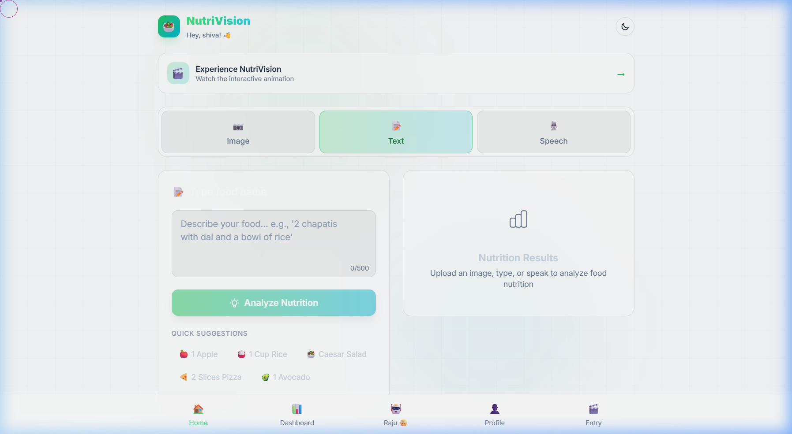
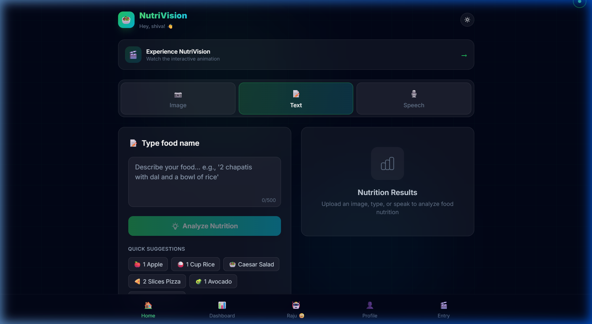
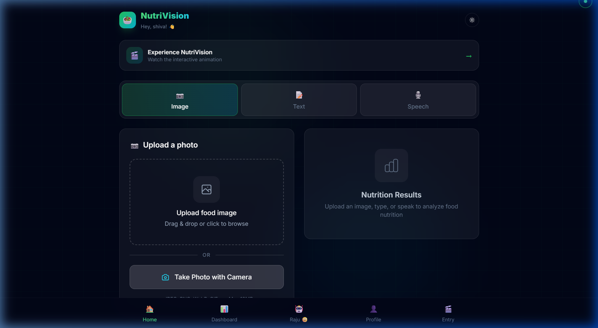
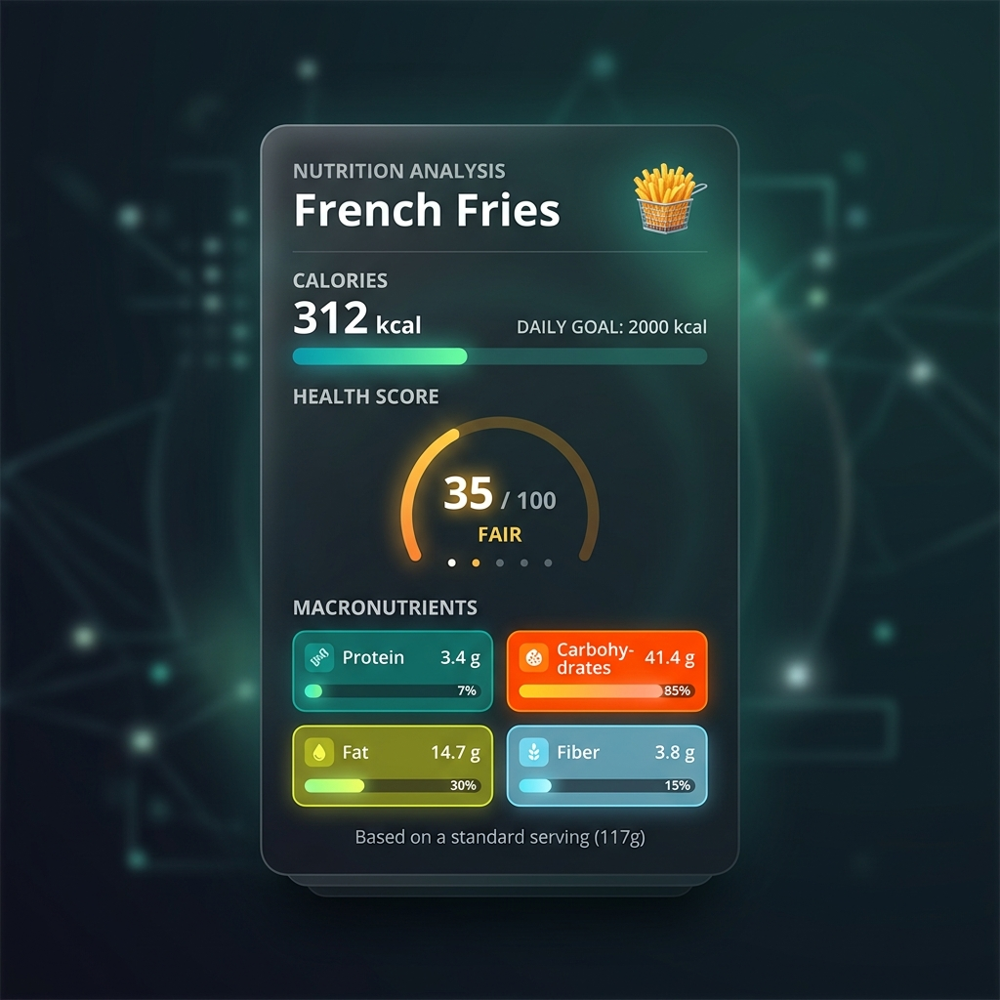
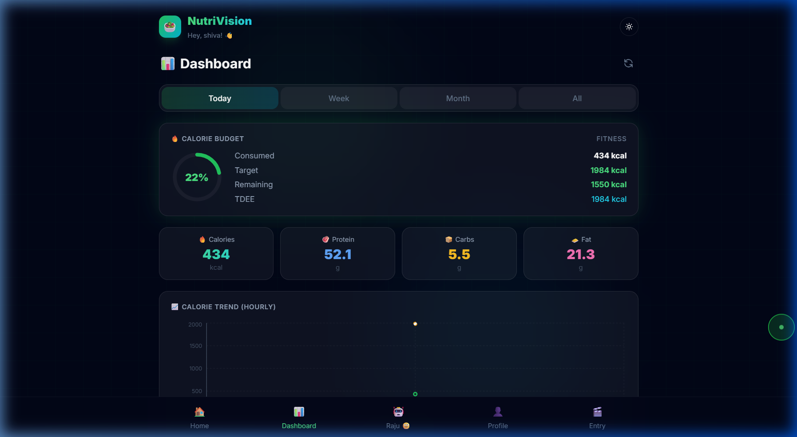
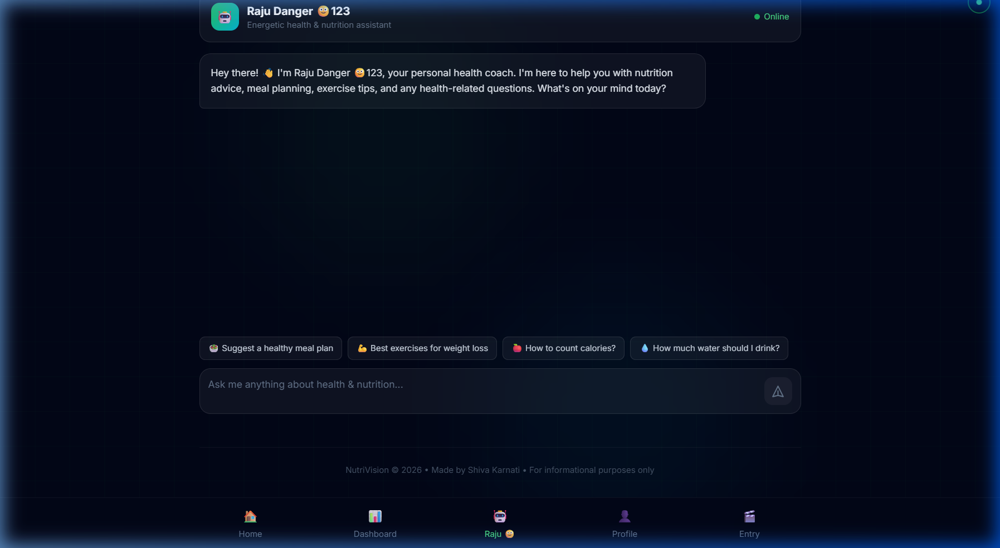
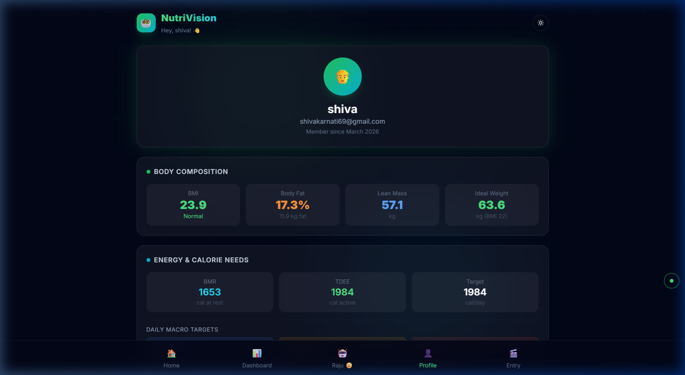
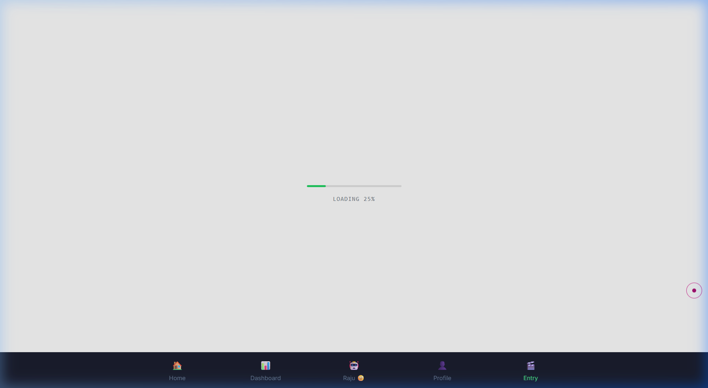

<p align="center">
  
</p>

<h1 align="center">🥗 NutriVision</h1>
<h3 align="center">AI-Powered Deep Nutrition Analysis — From Images, Text & Voice</h3>

<p align="center">
  
  
  
  
  
</p>

<p align="center">
  <b>Snap a photo of your meal, type what you ate, or just speak — NutriVision instantly gives you a complete nutrition breakdown powered by Google Gemini 2.5 Flash AI.</b>
</p>

---

## 🎬 Live App Demo

> Full walkthrough of the NutriVision application — navigating pages, switching themes, and exploring all features.

<p align="center">
  
</p>

---

## 📸 Application Screenshots

### 🏠 Home — Text Analysis (Light Mode)
> Clean, modern tri-modal food input with quick suggestion chips and real-time analysis.

<p align="center">
  
</p>

### 🌙 Home — Dark Mode
> Premium glassmorphism dark theme with smooth transitions, glowing accent colors, and custom cursor.

<p align="center">
  
</p>

### 📷 Image Upload & Camera
> Drag-and-drop or use your device camera — AI identifies food and returns complete nutrition data.

<p align="center">
  
</p>

### 🍟 AI Nutrition Analysis Card
> Complete nutrition breakdown with calories, macros, vitamins, minerals, health score, allergens, and diet tags.

<p align="center">
  
</p>

### 📊 Dashboard — Real Nutrition Data
> Track your daily intake with calorie budget, macro cards, and hourly trend charts. Shows real analyzed data: **434 kcal consumed, 52.1g protein, 5.5g carbs, 21.3g fat**.

<p align="center">
  
</p>

### 🤖 Raju Danger 🙂123 — AI Health Coach
> Your personalized AI nutrition assistant who reads your health profile and gives tailored advice on meals, exercises, calories, and hydration.

<p align="center">
  
</p>

### 👤 Profile — Body Composition & Calorie Needs
> Complete health profile with **BMI (23.9 Normal)**, body fat (17.3%), lean mass, ideal weight, **BMR (1653 cal)**, **TDEE (1984 cal)**, and personalized daily macro targets.

<p align="center">
  
</p>

### 🎬 Entry Animation — Scroll Canvas
> GSAP-powered landing page with frame-by-frame scroll animation and loading progress bar.

<p align="center">
  
</p>

---

## 🧠 What is NutriVision?

**NutriVision** is a full-stack AI-powered nutrition analysis application that transforms how people understand their food. Instead of manually searching nutrition databases, users can simply:

| Input Method | How It Works |
|:---:|:---|
| 📷 **Image** | Upload a photo of your meal — AI identifies the food and returns full macros, micros, vitamins & minerals |
| 📝 **Text** | Type "2 chapatis with dal and rice" — get instant nutritional breakdown |
| 🎙️ **Voice** | Speak what you ate using Web Speech API — hands-free nutrition tracking |

Every analysis returns a comprehensive nutrition card with **calories, macronutrients, vitamins, minerals, health score, allergen warnings, and diet tags** — all powered by **Google Gemini 2.5 Flash** generative AI.

---

## ✨ Key Features

### 🔬 Core Analysis
- **Tri-Modal Input** — Image upload, text description, or voice input
- **AI-Powered Nutrition Extraction** — Google Gemini 2.5 Flash with structured JSON output
- **Comprehensive Nutrition Cards** — Calories, protein, carbs, fat, fiber, vitamins, minerals
- **Health Score (1-100)** — AI-generated overall nutritional quality rating
- **Allergen Detection** — Automatic allergen identification (gluten, dairy, nuts, etc.)
- **Diet Tags** — Vegan, keto, high-protein, low-carb, etc.
- **Adjustable Serving Weight** — Slider to scale nutrition data by actual portion size

### 🔐 Authentication & Security
- **Email OTP Verification** — Secure signup with 6-digit OTP via SMTP
- **JWT Token Auth** — Stateless authentication with 30-day expiry
- **Password Reset Flow** — Full forgot-password → OTP → reset pipeline
- **bcryptjs Hashing** — Industry-standard password hashing (12 rounds)

### 📊 Dashboard & Analytics
- **Period-Based Filtering** — Today / Week / Month / All time views
- **Calorie Budget Tracker** — Visual donut chart with consumed vs target
- **Macro Distribution** — Protein, carbs, fat breakdown cards
- **Calorie Trend Chart** — Hourly/daily calorie intake visualization
- **Meal History** — Full log of all analyzed foods with timestamps
- **Auto-Save** — Authenticated analyses are automatically saved to history

### 👤 Health Profile
- **Onboarding Flow** — Multi-step profile setup after signup
- **Body Composition** — BMI, body fat %, lean mass, ideal weight calculations
- **Energy Needs** — BMR, TDEE, target calorie computation (Mifflin-St Jeor)
- **Daily Macro Targets** — Personalized protein, carbs, fat goals
- **Health Conditions & Goals** — Custom health tracking

### 🤖 AI Health Coach (Raju Danger 🙂123)
- **Personalized Advice** — Reads your profile (age, weight, BMI, goals) for tailored recommendations
- **Context-Aware Chat** — Full conversation history maintained per session
- **Quick Suggestion Chips** — Meal plans, exercises, calorie counting, hydration
- **Professional Boundaries** — Always recommends consulting healthcare professionals

### 🎨 UI/UX
- **Dark / Light Mode** — Smooth theme transitions with CSS custom properties
- **Glassmorphism Design** — Backdrop blur, subtle borders, glowing gradients
- **Custom Cursor** — Interactive dot-follower cursor on desktop
- **Framer Motion Animations** — Page transitions, card reveals, hover effects
- **Mobile-First Responsive** — Optimized for all screen sizes
- **Bottom Navigation** — Mobile-native tab bar with active indicators
- **Scroll Canvas Animation** — GSAP-powered landing page with frame sequence

---

## 🏗️ Architecture

```
┌─────────────────────────────────────────────────────────────────┐
│                        CLIENT (React 19 + Vite 7)                │
│  ┌──────────┐  ┌──────────┐  ┌──────────┐  ┌────────────────┐  │
│  │  Pages   │  │Components│  │ Context  │  │   Services     │  │
│  │----------│  │----------│  │----------│  │----------------│  │
│  │ Landing  │  │ImageUpload│  │AuthContext│  │ api.js (axios) │  │
│  │ Login    │  │TextInput │  │          │  │                │  │
│  │ Signup   │  │SpeechInput│  │          │  │                │  │
│  │ Dashboard│  │NutritionCard│ │         │  │                │  │
│  │ Chatbot  │  │ThemeToggle│  │          │  │                │  │
│  │ Profile  │  │CustomCursor│ │          │  │                │  │
│  │Onboarding│  │ History  │  │          │  │                │  │
│  └──────────┘  └──────────┘  └──────────┘  └────────────────┘  │
└──────────────────────────────┬──────────────────────────────────┘
                               │ HTTP/REST (Axios)
                               ▼
┌─────────────────────────────────────────────────────────────────┐
│                  SERVER (Express 5 + Node.js)                    │
│  ┌──────────────┐  ┌──────────────┐  ┌──────────────────────┐   │
│  │   Routes     │  │  Middleware   │  │     Services         │   │
│  │--------------│  │--------------│  │----------------------│   │
│  │analyzeRoutes │  │  auth.js     │  │  gemini.js (AI)      │   │
│  │ authRoutes   │  │  (JWT verify)│  │  email.js (SMTP/OTP) │   │
│  │ userRoutes   │  │              │  │                      │   │
│  │ chatRoutes   │  │              │  │                      │   │
│  └──────────────┘  └──────────────┘  └──────────────────────┘   │
└──────────────────────────────┬───────────────────────────────────┘
                               │
              ┌────────────────┼────────────────┐
              ▼                ▼                ▼
     ┌──────────────┐  ┌─────────────┐  ┌────────────┐
     │  PostgreSQL  │  │Google Gemini│  │  Gmail SMTP│
     │  (Database)  │  │  2.5 Flash  │  │ (Nodemailer)│
     └──────────────┘  └─────────────┘  └────────────┘
```

### Tech Stack

| Layer | Technology | Purpose |
|:---|:---|:---|
| **Frontend** | React 19.2 + Vite 7 | SPA with HMR, fast builds |
| **Styling** | Tailwind CSS 3.4 | Utility-first responsive design |
| **Animations** | Framer Motion + GSAP | Page transitions, scroll animations |
| **Charts** | Recharts 3.8 | Dashboard data visualization |
| **Backend** | Express 5 + Node.js | RESTful API server |
| **AI Engine** | Google Gemini 2.5 Flash | Food recognition, nutrition extraction, health coaching |
| **Database** | PostgreSQL 14+ | User data, analysis history, OTPs |
| **Auth** | JWT + bcryptjs | Stateless token authentication |
| **Email** | Nodemailer + Gmail SMTP | OTP delivery for signup/reset |
| **File Upload** | Multer (memory storage) | In-memory image processing |

---

## 📁 Project Structure

```
nutrivision/
├── 📂 client/                    # React Frontend (Vite)
│   ├── 📂 public/
│   │   ├── logo.jpg              # App logo
│   │   └── sequence/             # Landing page animation frames (140 frames)
│   ├── 📂 src/
│   │   ├── 📂 components/
│   │   │   ├── CustomCursor.jsx  # Interactive cursor effect
│   │   │   ├── History.jsx       # Analysis history list
│   │   │   ├── ImageUpload.jsx   # Drag-drop + camera image input
│   │   │   ├── NutriScrollCanvas.jsx  # GSAP scroll animation
│   │   │   ├── NutritionCard.jsx # Full nutrition result display
│   │   │   ├── SpeechInput.jsx   # Web Speech API voice input
│   │   │   ├── TextInput.jsx     # Text food description input
│   │   │   └── ThemeToggle.jsx   # Dark/Light mode toggle
│   │   ├── 📂 context/
│   │   │   └── AuthContext.jsx   # JWT auth state management
│   │   ├── 📂 pages/
│   │   │   ├── Chatbot.jsx       # AI health coach chat UI
│   │   │   ├── Dashboard.jsx     # Nutrition analytics dashboard
│   │   │   ├── ForgotPassword.jsx# Password reset flow
│   │   │   ├── Landing.jsx       # Animated landing page
│   │   │   ├── Login.jsx         # Login form
│   │   │   ├── Onboarding.jsx    # Multi-step profile setup
│   │   │   ├── Profile.jsx       # User profile & body metrics
│   │   │   └── Signup.jsx        # OTP-verified registration
│   │   ├── 📂 services/
│   │   │   └── api.js            # Axios API client (auto-detects prod/dev)
│   │   ├── App.jsx               # Root component + routing
│   │   ├── index.css             # Global styles + Tailwind
│   │   └── main.jsx              # React DOM entry point
│   ├── index.html
│   ├── vite.config.js
│   ├── tailwind.config.js
│   └── package.json
│
├── 📂 server/                    # Express Backend
│   ├── 📂 config/
│   │   └── db.js                 # PostgreSQL pool + auto-migration + DATABASE_URL support
│   ├── 📂 middleware/
│   │   └── auth.js               # JWT auth + optional auth middleware
│   ├── 📂 routes/
│   │   ├── analyzeRoutes.js      # POST /image, /text, /speech + GET /history, /stats
│   │   ├── authRoutes.js         # POST /signup, /verify-otp, /login, /forgot-password, /reset-password
│   │   ├── chatRoutes.js         # POST / (AI health coach)
│   │   └── userRoutes.js         # POST /onboarding + GET,PUT /profile
│   ├── 📂 services/
│   │   ├── email.js              # Nodemailer OTP email (HTML template)
│   │   └── gemini.js             # Gemini AI — image/text analysis with retry + JSON extraction
│   ├── server.js                 # Express entry + CORS + static serving (production)
│   └── package.json
│
├── 📂 docs/screenshots/          # App screenshots for README
├── .env.example                  # Environment variable template
├── .gitignore
├── render.yaml                   # Render deployment blueprint
├── LICENSE                       # MIT License
└── README.md
```

---

## 🚀 Getting Started

### Prerequisites

| Tool | Version | Purpose |
|:---|:---|:---|
| **Node.js** | 18+ (LTS 20 recommended) | JavaScript runtime |
| **npm** | 9+ | Package manager |
| **PostgreSQL** | 14+ | Relational database |
| **Gemini API Key** | [Get one free](https://aistudio.google.com/apikey) | AI nutrition analysis |
| **Gmail App Password** | [Generate here](https://myaccount.google.com/apppasswords) | SMTP email for OTPs |

### 1️⃣ Clone the Repository

```bash
git clone https://github.com/shivakarnati2004/nutrivision.git
cd nutrivision
```

### 2️⃣ Configure Environment Variables

```bash
cp .env.example server/.env
```

Edit `server/.env` with your actual values:

```env
GEMINI_API_KEY=your_gemini_api_key
DB_USER=postgres
DB_PASSWORD=your_postgres_password
DB_NAME=nutrivision
JWT_SECRET=your_strong_random_secret
SMTP_HOST=smtp.gmail.com
SMTP_PORT=587
SMTP_USER=your_email@gmail.com
SMTP_PASSWORD=your_gmail_app_password
EMAIL_FROM=your_email@gmail.com
```

### 3️⃣ Install & Run

```bash
# Install dependencies
npm --prefix server install
npm --prefix client install

# Terminal 1 — Backend API (port 3001)
npm --prefix server start

# Terminal 2 — Frontend dev server (port 5173)
npm --prefix client run dev
```

### 4️⃣ Verify Setup

| Check | URL | Expected |
|:---|:---|:---|
| API Health | http://localhost:3001/api/health | `{ "status": "ok", "database": "connected" }` |
| Frontend | http://localhost:5173 | React app loads |
| Signup | Create account | OTP email received |
| Analysis | Upload food photo or type food name | Nutrition card appears |

---

## 🔌 API Reference

### Health Check

```
GET /api/health                    # Server + database status (no auth)
```

### Authentication

```
POST /api/auth/signup              # Send OTP to email for registration
POST /api/auth/verify-otp          # Verify OTP + create account with profile
POST /api/auth/login               # Email + password login → JWT token
POST /api/auth/forgot-password     # Send password reset OTP
POST /api/auth/reset-password      # Verify OTP + set new password
```

### Food Analysis

```
POST /api/analyze/image            # Analyze food from image (multipart/form-data)
POST /api/analyze/text             # Analyze food from text description
POST /api/analyze/speech           # Analyze food from speech-to-text
POST /api/analyze/save        🔒   # Save analysis to user history
GET  /api/analyze/history     🔒   # Get user's analysis history (?period=day|week|month)
GET  /api/analyze/stats       🔒   # Get aggregated nutrition stats
DELETE /api/analyze/history/:id 🔒  # Delete a history entry
```

### User Profile

```
POST /api/user/onboarding     🔒   # Save onboarding profile data
GET  /api/user/profile        🔒   # Get user profile
PUT  /api/user/profile        🔒   # Update user profile
```

### AI Health Coach

```
POST /api/chat                🔒   # Send message to Raju Danger 🙂123
```

> 🔒 = Requires `Authorization: Bearer <JWT_TOKEN>` header

---

## 🧪 Database Schema

```sql
-- Auto-created on server startup — no manual migration needed

CREATE TABLE users (
    id SERIAL PRIMARY KEY,
    email VARCHAR(255) UNIQUE NOT NULL,
    password_hash VARCHAR(255) NOT NULL,
    name VARCHAR(255),
    gender VARCHAR(20),
    height_cm DECIMAL(5,1),
    weight_kg DECIMAL(5,1),
    age INTEGER,
    bmi DECIMAL(4,1),
    exercise_level VARCHAR(30),
    health_conditions TEXT,
    health_goals TEXT,
    is_verified BOOLEAN DEFAULT false,
    onboarding_complete BOOLEAN DEFAULT false,
    created_at TIMESTAMP DEFAULT CURRENT_TIMESTAMP,
    updated_at TIMESTAMP DEFAULT CURRENT_TIMESTAMP
);

CREATE TABLE otps (
    id SERIAL PRIMARY KEY,
    email VARCHAR(255) NOT NULL,
    otp_code VARCHAR(10) NOT NULL,
    purpose VARCHAR(20) NOT NULL,   -- 'signup' or 'reset'
    expires_at TIMESTAMP NOT NULL,
    used BOOLEAN DEFAULT false,
    created_at TIMESTAMP DEFAULT CURRENT_TIMESTAMP
);

CREATE TABLE nutrition_analyses (
    id SERIAL PRIMARY KEY,
    user_id INTEGER REFERENCES users(id) ON DELETE CASCADE,
    input_type VARCHAR(20) NOT NULL, -- 'image', 'text', 'speech'
    input_text TEXT,
    food_name VARCHAR(500),
    nutrition_data JSONB,
    food_weight_grams DECIMAL(8,1) DEFAULT 100,
    image_url TEXT,
    created_at TIMESTAMP DEFAULT CURRENT_TIMESTAMP
);
```

---

## 🏋️ Challenges & Solutions During Development

| # | Challenge | Solution |
|:---|:---|:---|
| 1 | **Gemini response parsing** — AI returns thinking parts mixed with JSON | Built `getResponseText()` that filters `thought` parts and `extractJSON()` with code-block extraction, brace matching, and plain parse fallback |
| 2 | **OTP email delivery** — Gmail blocks less-secure apps | Used Gmail App Passwords with Nodemailer SMTP, avoiding OAuth complexity |
| 3 | **Image analysis reliability** — Network timeouts on large images | Retry logic with exponential backoff (3 attempts) + `responseMimeType: 'application/json'` for structured output |
| 4 | **Database portability** — Local PostgreSQL vs cloud PostgreSQL | Dual connection: `DATABASE_URL` for cloud, individual `DB_*` vars for local — with SSL auto-detection |
| 5 | **Theme persistence** — Dark/light mode resets on navigation | CSS custom properties with `localStorage`-backed toggle on `:root` element |
| 6 | **BMI & calorie calculations** — Inaccurate fitness metrics | Mifflin-St Jeor equation for BMR, activity multiplier for TDEE, clinical BMI categories |
| 7 | **Scroll animation performance** — 140 frames loading slowly | GSAP ScrollTrigger with canvas rendering + progress-based preloading |
| 8 | **Multi-step signup** — Complex OTP + profile onboarding | Chained flow: email → OTP → password + profile → JWT — all in one verify-otp endpoint |

---

## 🔒 Security

- ✅ Passwords hashed with **bcryptjs** (12 salt rounds)
- ✅ **JWT tokens** with 30-day expiry
- ✅ **OTP expiry** (10 minutes) prevents brute-force
- ✅ **Input validation** on all endpoints
- ✅ **File type filtering** — only JPEG, PNG, WebP, GIF
- ✅ **10MB upload limit** prevents payload abuse
- ✅ **Environment variables** for all secrets
- ✅ **CORS** origin restriction

---

## 🗺️ Roadmap

- [ ] 📱 React Native mobile app
- [ ] 🍽️ Meal planning & recipe suggestions
- [ ] 📈 Weekly/monthly nutrition reports (PDF export)
- [ ] 🔔 Meal reminder notifications
- [ ] 🌐 Multi-language support (Hindi, Telugu, Spanish)
- [ ] 📸 Barcode/label scanner for packaged foods
- [ ] 🔄 Progressive Web App (PWA) support
- [ ] 🏋️ Workout tracking integration

---

## 🤝 Contributing

1. **Fork** the repository
2. **Create** a feature branch: `git checkout -b feature/amazing-feature`
3. **Commit** your changes: `git commit -m 'feat: add amazing feature'`
4. **Push** to the branch: `git push origin feature/amazing-feature`
5. **Open** a Pull Request

---

## 📄 License

This project is licensed under the **MIT License** — see the [LICENSE](LICENSE) file for details.

---

## 👨‍💻 Author

<table align="center">
  <tr>
    <td align="center">
      <h3>Shiva Karnati</h3>
      <p>Full-Stack Developer & AI Enthusiast</p>
    </td>
  </tr>
  <tr>
    <td>
      📞 <strong>Phone:</strong> +91-9014266763<br/>
      📧 <strong>Email:</strong> <a href="mailto:shivakarnati2004@gmail.com">shivakarnati2004@gmail.com</a><br/>
      🔗 <strong>GitHub:</strong> <a href="https://github.com/shivakarnati2004">github.com/shivakarnati2004</a><br/>
      🔗 <strong>LinkedIn:</strong> <a href="https://www.linkedin.com/in/shiva-karnati123/">linkedin.com/in/shiva-karnati123</a>
    </td>
  </tr>
</table>

---

## 🙏 Acknowledgements

- [Google Gemini AI](https://ai.google.dev/) — Generative AI engine
- [React](https://react.dev/) — Frontend framework
- [Express.js](https://expressjs.com/) — Backend framework
- [Tailwind CSS](https://tailwindcss.com/) — Utility-first CSS
- [Framer Motion](https://www.framer.com/motion/) — Animation library
- [GSAP](https://gsap.com/) — Scroll-driven animations
- [Recharts](https://recharts.org/) — Data visualization
- [Nodemailer](https://nodemailer.com/) — Email service

---

<p align="center">
  <sub>Built with ❤️ and ☕ by <a href="https://github.com/shivakarnati2004">Shiva Karnati</a> — April 2026</sub>
</p>

<p align="center">
  
  
</p>
