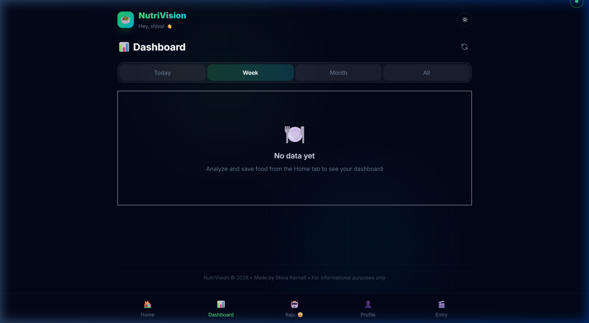

<p align="center">
  
</p>

<h1 align="center">🥗 NutriVision</h1>
<h3 align="center">AI-Powered Deep Nutrition Analysis — From Images, Text & Voice</h3>

<p align="center">
  
  
  
  
  
  
</p>

<p align="center">
  <b>Snap a photo of your meal, type what you ate, or just speak — NutriVision instantly gives you a complete nutrition breakdown powered by Google Gemini 2.5 Flash AI.</b>
</p>

---

## 📸 Application Showcase

### 🏠 Home — Light Mode
> The clean, modern main interface with tri-modal food input: Image upload, Text description, and Voice recognition.


### 🌙 Home — Dark Mode
> Premium glassmorphism dark theme with smooth transitions and glowing accent colors.


### 📊 Dashboard
> Track your nutrition over time with period-based filtering (Today, Week, Month, All).



### 🤖 Raju Danger 🙂123 — AI Health Coach
> Your personalized AI nutrition assistant who knows your health profile and gives tailored advice.


### 👤 Profile & Body Metrics
> Complete health profile with BMI, body composition, calorie needs (BMR/TDEE), and macro targets.


### 📷 Image Upload
> Drag & drop or camera capture — analyze any food instantly from a photo.


---

## 🎬 Live Demo Recording

> Full walkthrough of the NutriVision application — switching themes, navigating pages, and exploring features.

https://github.com/user-attachments/assets/placeholder-video

---

## 🧠 What is NutriVision?

**NutriVision** is a full-stack AI-powered nutrition analysis application that transforms how people understand their food. Instead of manually searching nutrition databases, users can simply:

| Input Method | How It Works |
|:---:|:---|
| 📷 **Image** | Upload a photo of your meal — AI identifies the food and returns full macros, micros, vitamins & minerals |
| 📝 **Text** | Type "2 chapatis with dal and rice" — get instant nutritional breakdown |
| 🎙️ **Voice** | Speak what you ate using Web Speech API — hands-free nutrition tracking |

Every analysis returns a comprehensive nutrition card with **calories, macronutrients, vitamins, minerals, health score, allergen warnings, and diet tags** — all powered by **Google Gemini 2.5 Flash** generative AI.

---

## ✨ Key Features

### 🔬 Core Analysis
- **Tri-Modal Input** — Image upload, text description, or voice input
- **AI-Powered Nutrition Extraction** — Google Gemini 2.5 Flash with structured JSON output
- **Comprehensive Nutrition Cards** — Calories, protein, carbs, fat, fiber, vitamins, minerals
- **Health Score (1-100)** — AI-generated overall nutritional quality rating
- **Allergen Detection** — Automatic allergen identification (gluten, dairy, nuts, etc.)
- **Diet Tags** — Vegan, keto, high-protein, low-carb, etc.
- **Adjustable Serving Weight** — Slider to scale nutrition data by actual portion size

### 🔐 Authentication & Security
- **Email OTP Verification** — Secure signup with 6-digit OTP via SMTP
- **JWT Token Auth** — Stateless authentication with 30-day expiry
- **Password Reset Flow** — Full forgot-password → OTP → reset pipeline
- **bcryptjs Hashing** — Industry-standard password hashing (12 rounds)

### 📊 Dashboard & Analytics
- **Period-Based Filtering** — Today / Week / Month / All time views
- **Calorie Tracking** — Cumulative calorie intake visualization
- **Macro Distribution** — Protein, carbs, fat breakdown
- **Meal History** — Full log of all analyzed foods with timestamps
- **Auto-Save** — Authenticated analyses are automatically saved to history

### 👤 Health Profile
- **Onboarding Flow** — Multi-step profile setup after signup
- **Body Composition** — BMI, body fat %, lean mass, ideal weight calculations
- **Energy Needs** — BMR, TDEE, target calorie computation (Mifflin-St Jeor)
- **Daily Macro Targets** — Personalized protein, carbs, fat goals
- **Health Conditions & Goals** — Custom health tracking

### 🤖 AI Health Coach (Raju Danger 🙂123)
- **Personalized Advice** — Reads your profile (age, weight, BMI, goals) for tailored recommendations
- **Context-Aware Chat** — Full conversation history maintained per session
- **Quick Suggestion Chips** — Meal plans, exercises, calorie counting, hydration
- **Professional Boundaries** — Always recommends consulting healthcare professionals

### 🎨 UI/UX
- **Dark / Light Mode** — Smooth theme transitions with CSS custom properties
- **Glassmorphism Design** — Backdrop blur, subtle borders, glowing gradients
- **Custom Cursor** — Interactive dot-follower cursor on desktop
- **Framer Motion Animations** — Page transitions, card reveals, hover effects
- **Mobile-First Responsive** — Optimized for all screen sizes
- **Bottom Navigation** — Mobile-native tab bar with active indicators
- **Scroll Canvas Animation** — GSAP-powered landing page with frame sequence

---

## 🏗️ Architecture & Tech Stack

```
┌─────────────────────────────────────────────────────────────────┐
│                        CLIENT (React 19 + Vite)                  │
│  ┌──────────┐  ┌──────────┐  ┌──────────┐  ┌──────────────────┐ │
│  │  Pages   │  │Components│  │ Context  │  │    Services      │ │
│  │----------│  │----------│  │----------│  │------------------│ │
│  │ Landing  │  │ImageUpload│  │AuthContext│  │ api.js (axios)  │ │
│  │ Login    │  │TextInput │  │          │  │                  │ │
│  │ Signup   │  │SpeechInput│  │          │  │                  │ │
│  │ Dashboard│  │NutritionCard│ │         │  │                  │ │
│  │ Chatbot  │  │ThemeToggle│  │          │  │                  │ │
│  │ Profile  │  │CustomCursor│ │          │  │                  │ │
│  │Onboarding│  │ History  │  │          │  │                  │ │
│  └──────────┘  └──────────┘  └──────────┘  └──────────────────┘ │
└──────────────────────────────┬──────────────────────────────────┘
                               │ HTTP/REST (Axios)
                               ▼
┌─────────────────────────────────────────────────────────────────┐
│                  SERVER (Express 5 + Node.js)                    │
│  ┌──────────────┐  ┌──────────────┐  ┌──────────────────────┐   │
│  │   Routes     │  │  Middleware   │  │     Services         │   │
│  │--------------│  │--------------│  │----------------------│   │
│  │analyzeRoutes │  │  auth.js     │  │  gemini.js (AI)      │   │
│  │ authRoutes   │  │  (JWT verify)│  │  email.js (SMTP/OTP) │   │
│  │ userRoutes   │  │              │  │                      │   │
│  │ chatRoutes   │  │              │  │                      │   │
│  └──────────────┘  └──────────────┘  └──────────────────────┘   │
│                                                                  │
│  ┌──────────────────────────────────────────────────────────┐    │
│  │              Config: db.js (PostgreSQL + auto-migration)  │    │
│  └──────────────────────────────────────────────────────────┘    │
└──────────────────────────────┬───────────────────────────────────┘
                               │
              ┌────────────────┼────────────────┐
              ▼                ▼                ▼
     ┌──────────────┐  ┌─────────────┐  ┌────────────┐
     │  PostgreSQL  │  │Google Gemini│  │  Gmail SMTP│
     │  (Database)  │  │  2.5 Flash  │  │  (Nodemailer)│
     │--------------│  │-------------│  │--------------│
     │ users        │  │Image Analysis│  │ OTP Emails  │
     │ otps         │  │Text Analysis│  │ Verification │
     │ nutrition_   │  │Chat/Coach   │  │ Password Reset│
     │   analyses   │  │             │  │              │
     └──────────────┘  └─────────────┘  └────────────┘
```

### Technology Breakdown

| Layer | Technology | Purpose |
|:---|:---|:---|
| **Frontend** | React 19.2 + Vite 7 | SPA with HMR, fast builds |
| **Styling** | Tailwind CSS 3.4 | Utility-first responsive design |
| **Animations** | Framer Motion + GSAP | Page transitions, scroll animations |
| **Charts** | Recharts 3.8 | Dashboard data visualization |
| **Backend** | Express 5 + Node.js | RESTful API server |
| **AI Engine** | Google Gemini 2.5 Flash | Food recognition, nutrition extraction, health coaching |
| **Database** | PostgreSQL 14+ | User data, analysis history, OTPs |
| **Auth** | JWT + bcryptjs | Stateless token authentication |
| **Email** | Nodemailer + Gmail SMTP | OTP delivery for signup/reset |
| **File Upload** | Multer (memory storage) | In-memory image processing |
| **Deployment** | Render (Web Service + PostgreSQL) | Cloud hosting with CI/CD |

---

## 📁 Project Structure

```
nutrivision/
├── 📂 client/                    # React Frontend (Vite)
│   ├── 📂 public/
│   │   ├── logo.jpg              # App logo
│   │   └── sequence/             # Landing page animation frames
│   ├── 📂 src/
│   │   ├── 📂 components/
│   │   │   ├── CustomCursor.jsx  # Interactive cursor effect
│   │   │   ├── History.jsx       # Analysis history list
│   │   │   ├── ImageUpload.jsx   # Drag-drop + camera image input
│   │   │   ├── NutriScrollCanvas.jsx  # GSAP scroll animation
│   │   │   ├── NutritionCard.jsx # Full nutrition result display
│   │   │   ├── SpeechInput.jsx   # Web Speech API voice input
│   │   │   ├── TextInput.jsx     # Text food description input
│   │   │   └── ThemeToggle.jsx   # Dark/Light mode toggle
│   │   ├── 📂 context/
│   │   │   └── AuthContext.jsx   # JWT auth state management
│   │   ├── 📂 pages/
│   │   │   ├── Chatbot.jsx       # AI health coach chat UI
│   │   │   ├── Dashboard.jsx     # Nutrition analytics dashboard
│   │   │   ├── ForgotPassword.jsx# Password reset flow
│   │   │   ├── Landing.jsx       # Animated landing page
│   │   │   ├── Login.jsx         # Login form
│   │   │   ├── Onboarding.jsx    # Multi-step profile setup
│   │   │   ├── Profile.jsx       # User profile & body metrics
│   │   │   └── Signup.jsx        # OTP-verified registration
│   │   ├── 📂 services/
│   │   │   └── api.js            # Axios API client
│   │   ├── App.jsx               # Root component + routing
│   │   ├── index.css             # Global styles + Tailwind
│   │   └── main.jsx              # React DOM entry point
│   ├── index.html                # HTML template
│   ├── vite.config.js            # Vite configuration
│   ├── tailwind.config.js        # Tailwind CSS configuration
│   └── package.json              # Frontend dependencies
│
├── 📂 server/                    # Express Backend
│   ├── 📂 config/
│   │   └── db.js                 # PostgreSQL pool + auto-migration
│   ├── 📂 middleware/
│   │   └── auth.js               # JWT auth + optional auth middleware
│   ├── 📂 routes/
│   │   ├── analyzeRoutes.js      # Food analysis + history + stats
│   │   ├── authRoutes.js         # Signup, login, OTP, password reset
│   │   ├── chatRoutes.js         # AI health coach endpoint
│   │   └── userRoutes.js         # Profile CRUD + onboarding
│   ├── 📂 services/
│   │   ├── email.js              # Nodemailer OTP email service
│   │   └── gemini.js             # Google Gemini AI integration
│   ├── server.js                 # Express app entry + static serving
│   └── package.json              # Backend dependencies
│
├── 📂 docs/screenshots/          # App screenshots for documentation
├── .env.example                  # Environment variable template
├── .gitignore                    # Git ignore rules
├── render.yaml                   # Render deployment blueprint
└── README.md                     # This file
```

---

## 🚀 Getting Started

### Prerequisites

| Tool | Version | Purpose |
|:---|:---|:---|
| **Node.js** | 18+ (LTS 20 recommended) | JavaScript runtime |
| **npm** | 9+ | Package manager |
| **PostgreSQL** | 14+ | Relational database |
| **Gemini API Key** | [Get one free](https://aistudio.google.com/apikey) | AI nutrition analysis |
| **Gmail App Password** | [Generate here](https://myaccount.google.com/apppasswords) | SMTP email for OTPs |

### 1️⃣ Clone the Repository

```bash
git clone https://github.com/shivakarnati2004/nutrivision.git
cd nutrivision
```

### 2️⃣ Configure Environment Variables

```bash
cp .env.example server/.env
```

Edit `server/.env` with your actual values:

```env
# Required
GEMINI_API_KEY=your_gemini_api_key
DB_USER=postgres
DB_PASSWORD=your_postgres_password
DB_NAME=nutrivision
JWT_SECRET=your_strong_random_secret

# Email (for OTP verification)
SMTP_HOST=smtp.gmail.com
SMTP_PORT=587
SMTP_USER=your_email@gmail.com
SMTP_PASSWORD=your_gmail_app_password
EMAIL_FROM=your_email@gmail.com
```

### 3️⃣ Install Dependencies

```bash
# Install server dependencies
npm --prefix server install

# Install client dependencies
npm --prefix client install
```

### 4️⃣ Start Development Servers

```bash
# Terminal 1 — Backend API
npm --prefix server start

# Terminal 2 — Frontend dev server
npm --prefix client run dev
```

### 5️⃣ Verify Setup

| Check | URL | Expected |
|:---|:---|:---|
| API Health | http://localhost:3001/api/health | `{ "status": "ok", "database": "connected" }` |
| Frontend | http://localhost:5173 | React app loads |
| Signup Flow | Create account | OTP email received |
| Image Analysis | Upload food photo | Nutrition card appears |

---

## ☁️ Deploy to Render

NutriVision is configured for one-click deployment on [Render](https://render.com).

### Option A: Blueprint Deployment (Recommended)

1. Push your code to GitHub
2. Go to [Render Dashboard](https://dashboard.render.com) → **New** → **Blueprint**
3. Connect your GitHub repo
4. Render auto-detects `render.yaml` and creates:
   - ✅ Web Service (Node.js)
   - ✅ PostgreSQL Database
5. Set the `sync: false` environment variables manually:
   - `GEMINI_API_KEY`
   - `SMTP_USER`
   - `SMTP_PASSWORD`
   - `EMAIL_FROM`
6. Deploy! 🚀

### Option B: Manual Deployment

1. **Create PostgreSQL** database on Render → copy the **Internal Database URL**
2. **Create Web Service** → Connect GitHub repo
3. Configure:

   | Setting | Value |
   |:---|:---|
   | **Root Directory** | `server` |
   | **Build Command** | `npm run render-build` |
   | **Start Command** | `npm start` |
   | **Environment** | `Node` |

4. Add environment variables:

   | Variable | Value |
   |:---|:---|
   | `NODE_ENV` | `production` |
   | `DATABASE_URL` | *(from Render PostgreSQL)* |
   | `GEMINI_API_KEY` | *(your key)* |
   | `JWT_SECRET` | *(generate a random string)* |
   | `SMTP_HOST` | `smtp.gmail.com` |
   | `SMTP_PORT` | `587` |
   | `SMTP_USER` | *(your email)* |
   | `SMTP_PASSWORD` | *(your app password)* |
   | `EMAIL_FROM` | *(your email)* |
   | `CORS_ORIGIN` | `*` |

5. Deploy!

---

## 🔌 API Reference

### Authentication

| Method | Endpoint | Auth | Description |
|:---|:---|:---|:---|
| `POST` | `/api/auth/signup` | ❌ | Send OTP to email for registration |
| `POST` | `/api/auth/verify-otp` | ❌ | Verify OTP + create account |
| `POST` | `/api/auth/login` | ❌ | Email + password login |
| `POST` | `/api/auth/forgot-password` | ❌ | Send password reset OTP |
| `POST` | `/api/auth/reset-password` | ❌ | Reset password with OTP |

### Food Analysis

| Method | Endpoint | Auth | Description |
|:---|:---|:---|:---|
| `POST` | `/api/analyze/image` | ❌ | Analyze food from image (multipart) |
| `POST` | `/api/analyze/text` | ❌ | Analyze food from text description |
| `POST` | `/api/analyze/speech` | ❌ | Analyze food from speech text |
| `POST` | `/api/analyze/save` | ✅ | Save analysis to history |
| `GET` | `/api/analyze/history` | ✅ | Get user's analysis history |
| `GET` | `/api/analyze/stats` | ✅ | Get aggregated nutrition stats |
| `DELETE` | `/api/analyze/history/:id` | ✅ | Delete a history entry |

### User Profile

| Method | Endpoint | Auth | Description |
|:---|:---|:---|:---|
| `POST` | `/api/user/onboarding` | ✅ | Save onboarding profile data |
| `GET` | `/api/user/profile` | ✅ | Get user profile |
| `PUT` | `/api/user/profile` | ✅ | Update user profile |

### AI Chat

| Method | Endpoint | Auth | Description |
|:---|:---|:---|:---|
| `POST` | `/api/chat` | ✅ | Send message to AI health coach |

### Health Check

| Method | Endpoint | Auth | Description |
|:---|:---|:---|:---|
| `GET` | `/api/health` | ❌ | Server + DB status |

---

## 🧪 Database Schema

```sql
-- Users table (auto-created on server startup)
CREATE TABLE users (
    id SERIAL PRIMARY KEY,
    email VARCHAR(255) UNIQUE NOT NULL,
    password_hash VARCHAR(255) NOT NULL,
    name VARCHAR(255),
    gender VARCHAR(20),
    height_cm DECIMAL(5,1),
    weight_kg DECIMAL(5,1),
    age INTEGER,
    bmi DECIMAL(4,1),
    exercise_level VARCHAR(30),
    health_conditions TEXT,
    health_goals TEXT,
    is_verified BOOLEAN DEFAULT false,
    onboarding_complete BOOLEAN DEFAULT false,
    created_at TIMESTAMP DEFAULT CURRENT_TIMESTAMP,
    updated_at TIMESTAMP DEFAULT CURRENT_TIMESTAMP
);

-- OTP verification table
CREATE TABLE otps (
    id SERIAL PRIMARY KEY,
    email VARCHAR(255) NOT NULL,
    otp_code VARCHAR(10) NOT NULL,
    purpose VARCHAR(20) NOT NULL,  -- 'signup' or 'reset'
    expires_at TIMESTAMP NOT NULL,
    used BOOLEAN DEFAULT false,
    created_at TIMESTAMP DEFAULT CURRENT_TIMESTAMP
);

-- Nutrition analysis history
CREATE TABLE nutrition_analyses (
    id SERIAL PRIMARY KEY,
    user_id INTEGER REFERENCES users(id) ON DELETE CASCADE,
    input_type VARCHAR(20) NOT NULL,  -- 'image', 'text', 'speech'
    input_text TEXT,
    food_name VARCHAR(500),
    nutrition_data JSONB,
    food_weight_grams DECIMAL(8,1) DEFAULT 100,
    image_url TEXT,
    created_at TIMESTAMP DEFAULT CURRENT_TIMESTAMP
);
```

> **Note:** Tables are auto-created by the server on startup — no manual migration needed.

---

## 🏋️ Challenges & Solutions During Development

| # | Challenge | Solution |
|:---|:---|:---|
| 1 | **Gemini response parsing** — AI returns thinking parts mixed with JSON | Built a robust `getResponseText()` extractor that filters `thought` parts and a multi-strategy `extractJSON()` with code-block extraction, brace matching, and plain parse fallback |
| 2 | **OTP email delivery** — Gmail blocks less-secure apps | Used Gmail App Passwords with Nodemailer SMTP transport, avoiding OAuth complexity while maintaining security |
| 3 | **Image analysis reliability** — Network timeouts on large images | Implemented retry logic with exponential backoff (up to 3 attempts) and `responseMimeType: 'application/json'` for structured output |
| 4 | **Serving SPA + API on same port** — Render single-service constraint | Server serves static client build in production, with SPA fallback for client-side routing (`*` → `index.html`) |
| 5 | **Database portability** — Local PostgreSQL vs. Render PostgreSQL | Dual connection strategy: `DATABASE_URL` for cloud, individual `DB_*` vars for local — with SSL auto-detection |
| 6 | **CORS in production** — Cross-origin blocked on Render | Dynamic CORS origin resolution with `CORS_ORIGIN` env var, allowing `*` or comma-separated domains |
| 7 | **Theme persistence** — Dark/light mode resets on navigation | CSS custom properties with `localStorage`-backed theme toggle on the `:root` element |
| 8 | **BMI & calorie calculations** — Inaccurate fitness metrics | Implemented Mifflin-St Jeor equation for BMR, activity multiplier for TDEE, and clinical BMI categories |

---

## 🔒 Security Considerations

- ✅ Passwords hashed with **bcryptjs** (12 salt rounds)
- ✅ **JWT tokens** with 30-day expiry for stateless auth
- ✅ **OTP expiry** (10 minutes) prevents brute-force
- ✅ **Input validation** on all API endpoints
- ✅ **File type filtering** — only JPEG, PNG, WebP, GIF accepted
- ✅ **10MB upload limit** prevents payload abuse
- ✅ **Environment variables** for all secrets (never hardcoded)
- ✅ **CORS** configured to restrict origins
- ⚠️ **For production**: Rotate `JWT_SECRET`, use strong `GEMINI_API_KEY`, enable rate limiting

---

## 🗺️ Roadmap

- [ ] 📱 React Native mobile app (iOS + Android)
- [ ] 🍽️ Meal planning & recipe suggestions
- [ ] 📈 Advanced analytics with weekly/monthly reports
- [ ] 🔔 Push notifications for meal reminders
- [ ] 🌐 Multi-language support (Hindi, Telugu, Spanish)
- [ ] 🤝 Social features — share meals, compare with friends
- [ ] 🏋️ Workout tracking integration
- [ ] 📸 Barcode/label scanner for packaged foods
- [ ] 🔄 Progressive Web App (PWA) support
- [ ] 📊 Export nutrition data as PDF/CSV

---

## 🤝 Contributing

Contributions are welcome! Please follow these steps:

1. **Fork** the repository
2. **Create** a feature branch: `git checkout -b feature/amazing-feature`
3. **Commit** your changes: `git commit -m 'feat: add amazing feature'`
4. **Push** to the branch: `git push origin feature/amazing-feature`
5. **Open** a Pull Request

Please follow [Conventional Commits](https://www.conventionalcommits.org/) for commit messages.

---

## 📄 License

This project is licensed under the **MIT License** — see the [LICENSE](LICENSE) file for details.

---

## 👨‍💻 Author

<p align="center">
  
</p>

<table align="center">
  <tr>
    <td align="center">
      <strong>Shiva Karnati</strong><br/>
      Full-Stack Developer & AI Enthusiast
    </td>
  </tr>
  <tr>
    <td>
      📞 <strong>Phone:</strong> +91-9014266763<br/>
      📧 <strong>Email:</strong> <a href="mailto:shivakarnati2004@gmail.com">shivakarnati2004@gmail.com</a><br/>
      🔗 <strong>GitHub:</strong> <a href="https://github.com/shivakarnati2004">github.com/shivakarnati2004</a><br/>
      🔗 <strong>LinkedIn:</strong> <a href="https://www.linkedin.com/in/shiva-karnati123/">linkedin.com/in/shiva-karnati123</a>
    </td>
  </tr>
</table>

---

## 🙏 Acknowledgements

- [Google Gemini AI](https://ai.google.dev/) — Generative AI for nutrition analysis
- [React](https://react.dev/) — Frontend framework
- [Express.js](https://expressjs.com/) — Backend framework
- [Tailwind CSS](https://tailwindcss.com/) — Utility-first CSS
- [Framer Motion](https://www.framer.com/motion/) — Animation library
- [GSAP](https://gsap.com/) — Scroll-driven animations
- [Recharts](https://recharts.org/) — Data visualization
- [Render](https://render.com/) — Cloud deployment platform
- [Nodemailer](https://nodemailer.com/) — Email service

---

<p align="center">
  <sub>Built with ❤️ and ☕ by <a href="https://github.com/shivakarnati2004">Shiva Karnati</a> — April 2026</sub>
</p>

<p align="center">
  
  
</p>
